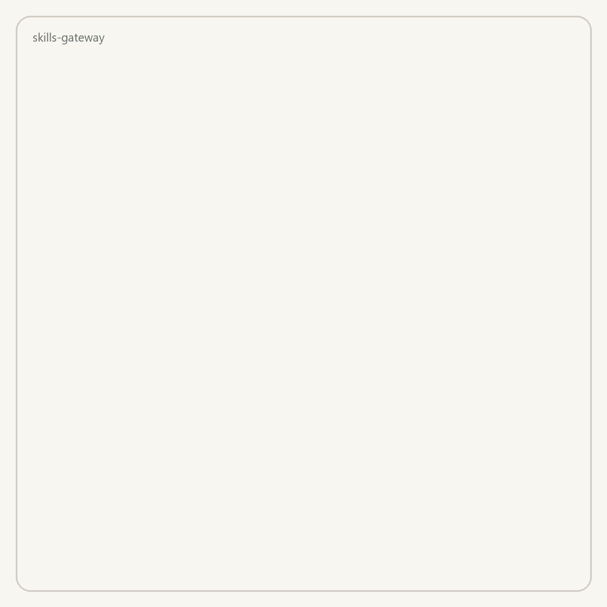

# Skills Gateway

**A governed, identity-aware server for [Agent Skills](https://agentskills.io).** Publish a skill once. Every agent in the organisation (Claude Code, Codex, Cursor, Copilot, Gemini CLI, Kiro, Windsurf) receives the skills its user is allowed to use, in the layout that agent expects, with a verifiable digest and an audit trail.

<p align="center">
  
</p>

```text
  WITHOUT A GATEWAY                      WITH SKILLS GATEWAY

  one skills repo                        one skills repo
        │                                      │  publish once
        │  copy, symlink, paste                ▼
        ├──► .claude/skills   dev A      ┌─────────────┐
        ├──► .cursor/skills   dev B      │   gateway   │  who is asking?
        ├──► .agents/skills   CI         │  identity   │  what may they load?
        └──► ...              laptop 4   │  + policy   │  which version exactly?
                                         └──────┬──────┘
  · nobody knows who has what                   │  verified copy, recorded
  · no way to keep one team out                 ├──► .claude/skills
  · copies drift, silently                      ├──► .cursor/skills
  · no record of who loaded what                └──► .agents/skills
```

> **Status: v0.1, early.** The API and the [protocol spec](docs/spec/skills-gateway-protocol.md) can still change. Feedback and issues are welcome.

## Why

Agent Skills made the skill *format* portable: `SKILL.md` directories are now read natively by every mainstream coding agent. Distributing skills inside an organisation is still mostly file copying. Nothing records who may use which skill, pins what a project installed, or shows who fetched what.

Skills Gateway adds that layer, and it is small enough to run as one binary:

- **Identity on every request.** Tokens from any OpenID Connect provider (Keycloak, Entra ID, Okta, Auth0, Cognito). Static tokens are available for development.
- **Policy on every fetch.** Rules are default-deny, and a deny always wins. They match on user, team, role and agent type, with namespace and name globs and semver ranges. Skills a caller may not fetch look exactly like missing skills.
- **Immutable, digest-verified versions.** A published version can never be overwritten. Its digest is computed from the files, not the archive, so it is stable, and clients verify it on download.
- **Append-only audit.** Every publish, deprecation and denied request is recorded, and each change is recorded in the same transaction as the change itself. Content reads (bundle, file, translate and MCP reads) are recorded too. Export the log as JSON Lines for your SIEM.
- **Native delivery.** `sgw sync` writes verified skills into each agent's own skills directory and keeps a lock file of digests. The MCP endpoint implements the [MCP Skills Extension (SEP-2640)](https://modelcontextprotocol.io/seps/2640-skills-extension), and it also offers plain tools for MCP clients that do not support the extension yet.

## How it works

### One request, from token to answer

Every request walks the same four steps. A caller who may not have a skill is told it does not exist, so the policy itself cannot be used to discover what is hidden.

```text
  request  ──  Authorization: Bearer <token>
     │
     ▼
  ┌──────────────────────────┐   OIDC (or a dev token) gives:
  │ 1  IDENTITY              │     subject · teams · roles · agent type
  │    who is calling?       │   the agent type comes from the token,
  └────────────┬─────────────┘   never from a header a client could set
               ▼
  ┌──────────────────────────┐   rules match on namespace, name,
  │ 2  POLICY                │   version range and agent type
  │    may they have it?     │   a deny always wins
  └────────────┬─────────────┘   nothing is allowed unless a rule says so
               │
      allow    │    deny ────────►  404 not found
               │                    (identical to a skill that isn't there)
               ▼
  ┌──────────────────────────┐   published versions never change
  │ 3  REGISTRY              │   "latest" = newest version THIS caller
  │    which version?        │            may fetch, stable over pre-release
  └────────────┬─────────────┘
               ▼
  ┌──────────────────────────┐   who, what, when, from where —
  │ 4  AUDIT                 │   appended, never edited or deleted
  └────────────┬─────────────┘
               ▼
    the skill, three ways:

    REST /v1          sgw sync            MCP /mcp
    bundle, files,    writes agent         skills/list, skills/get,
    metadata          folders directly     list_skills, get_skill
```

### Publishing: where the digest comes from

A skill is a folder, so the fingerprint covers every file in it, not just `SKILL.md`. It is built from the file contents, so re-zipping the same folder on another machine produces the same digest.

```text
  the skill folder                    each file hashed
  ┌───────────────────────┐
  │ SKILL.md              │  ──►  sha256  599662b6…
  │ references/           │
  │   checklist.md        │  ──►  sha256  d7dff65b…
  └───────────────────────┘
                                          │
              sorted list of "path + hash" for every file
                                          │
                                          ▼
                              sha256:344413734f917ab6…   ← the version's digest
                                          │
                 ┌────────────────────────┴────────────────────────┐
                 ▼                                                 ▼
        stored with the version                    sent on every download,
        and frozen forever                         and re-checked by the client
```

### Sync: what lands in your project

`sgw sync` reads a short file listing the skills and the agents you want. Nothing is written until every skill has been downloaded and checked, so a failure never leaves half-written folders.

```text
  sgw-sync.yaml                 gateway                      your project
  ────────────────              ───────                      ────────────
  formats:                         │
    [claude, cursor]               │  1  resolve "latest"  →  1.4.0
  skills:                          │  2  download that exact version
    - platform/code-review ────────┤  3  digest as promised?
    - payments/refunds@1.2.0       │         │
                                   │     no ─┴─►  stop; nothing is written
                                   │     yes
                                   ▼
                         translate on your machine
                        (from the bytes just verified)
                                   │
                                   ├──►  .claude/skills/code-review/…
                                   ├──►  .cursor/skills/code-review/…
                                   └──►  sgw-lock.json
                                           version + digest + file hashes
                                           (commit it; the next sync checks
                                            the same version still matches)
```

## Quick start

Requires Go 1.26+.

```bash
go install github.com/mthamil107/skills-gateway/cmd/sgw@latest

# 1. Run a local gateway with development tokens (use OIDC in production)
cp examples/sgw.yaml sgw.yaml
export SGW_ADMIN_TOKEN=$(openssl rand -hex 24) SGW_DEV_TOKEN=$(openssl rand -hex 24)
sgw serve -config sgw.yaml &

# 2. Publish a skill
export SGW_URL=http://127.0.0.1:8080 SGW_TOKEN=$SGW_ADMIN_TOKEN
sgw publish examples/skills/code-review -ns platform -version 1.0.0

# 3. Find it and install it for Claude Code and Cursor
sgw list
sgw fetch platform/code-review -format claude
sgw fetch platform/code-review -format cursor
```

Or keep a manifest in the project and sync it (in CI or on checkout):

```yaml
# sgw-sync.yaml
formats: [claude, codex, cursor]
skills:
  - platform/code-review
  - payments/refund-policy@1.2.0
```

```bash
sgw sync        # verifies digests, writes files, updates sgw-lock.json
```

With Docker:

```bash
docker build -t skills-gateway .
docker run -p 8080:8080 -v $PWD/sgw.yaml:/etc/sgw/sgw.yaml -v $PWD/examples:/data/examples \
  -e SGW_ADMIN_TOKEN -e SGW_DEV_TOKEN skills-gateway
```

In the container, set `listen: 0.0.0.0:8080` in `sgw.yaml`.

## Connect an MCP client

Point any MCP client that supports Streamable HTTP at `http://<gateway>/mcp`, with an `Authorization: Bearer <token>` header. For Claude Code:

```bash
claude mcp add --transport http skills http://127.0.0.1:8080/mcp \
  --header "Authorization: Bearer $SGW_TOKEN"
```

The agent can then call `list_skills`, `get_skill` and `read_skill_file`. Clients that implement SEP-2640 use `skills/list` and `skills/get` directly, over `skill://<namespace>/<name>/...` URIs.

## Policy

```yaml
version: 1
rules:
  - id: admins-everything
    effect: allow
    subject: { roles: [platform-admin] }
    actions: [fetch, publish, deprecate, admin]
    resource: { namespace: "*", name: "*" }

  - id: everyone-reads-platform
    effect: allow
    subject: { any: true }
    actions: [fetch]
    resource: { namespace: platform, name: "*" }

  - id: payments-team-owns-payments
    effect: allow
    subject: { teams: [payments] }
    actions: [fetch, publish, deprecate]
    resource: { namespace: payments, name: "*" }

  - id: internal-skills-not-for-cursor-or-codex
    effect: deny
    subject: { agent_types: [cursor, codex] }
    actions: [fetch]
    resource: { namespace: platform, name: "internal-*" }
```

Agent type comes from a token claim (`sgw_agent` by default), never from a request header. The evaluator sits behind an interface, and its input document is `{principal, action, resource}`, so it can be swapped for OPA or Cedar.

## Agent formats

| Format | Written to | Read by |
|---|---|---|
| `claude` | `.claude/skills/<name>/` | Claude Code (also Copilot and Windsurf) |
| `codex` | `.agents/skills/<name>/` | OpenAI Codex (also Windsurf) |
| `cursor` | `.cursor/skills/<name>/` | Cursor |
| `copilot` | `.github/skills/<name>/` | GitHub Copilot |
| `gemini` | `.gemini/skills/<name>/` | Gemini CLI |
| `kiro` | `.kiro/skills/<name>/` | Kiro |
| `windsurf` | `.windsurf/skills/<name>/` | Windsurf |
| `cursor-rules` | `.cursor/rules/<name>.mdc` | Cursor legacy project rules (lossy; `SKILL.md` only) |

Directory locations follow each agent's documentation as of September 2026. Every target except `cursor-rules` is the unmodified skill directory, because the agents read `SKILL.md` natively.

## API

- REST: [`openapi.yaml`](internal/server/openapi.yaml), also served at `GET /openapi.yaml`.
- Protocol, bundle and digest rules, and the MCP mapping: [`docs/spec/skills-gateway-protocol.md`](docs/spec/skills-gateway-protocol.md).

## How it compares

Several projects already cover parts of this space, and they are worth knowing:

| Project | What it is |
|---|---|
| [MCP Gateway Registry](https://github.com/agentic-community/mcp-gateway-registry) | A registry and gateway for MCP servers, agents and skills: OAuth2/OIDC (Keycloak, Entra, Okta, Cognito), scanning, visibility controls. A larger deployment (nginx, FastAPI, MongoDB/DocumentDB). |
| [agentregistry](https://github.com/agentregistry-dev/agentregistry) + [agentgateway](https://github.com/agentgateway/agentgateway) | A catalog of MCP servers, agents and skills, plus a policy-enforcing gateway. |
| [SkillHub (iFlytek)](https://github.com/iflytek/skillhub) | A self-hosted enterprise skill registry with RBAC, review and audit. |
| [openskills](https://github.com/numman-ali/openskills), [Skills Hub](https://github.com/qufei1993/skills-hub), [AgentPort](https://github.com/omrgpt/agentport) | Local tools that load, sync or convert skills across agents. |

Skills Gateway focuses on the narrower combination: a single small binary where **identity and policy decide every individual fetch**, published versions are **immutable and digest-verified end to end**, and the same governed catalog is served over **REST, native sync and SEP-2640 MCP**.

## Roadmap

- **v0.2:** OPA/Cedar policy backends, scan-on-publish hooks (for example [prompt-shield](https://github.com/mthamil107/prompt-shield)), a review state before publish.
- **v0.3:** signed skills (Sigstore), a GitHub App for Git-native sync, more translators.
- **v0.4:** PostgreSQL, a Helm chart, full-text search, a small admin UI.

## Security

The gateway serves skill content and never executes it. Skills can still include scripts that agents run, so treat `publish` rights like commit rights. The spec's [security considerations](docs/spec/skills-gateway-protocol.md#11-security-considerations) cover this in detail. See [SECURITY.md](SECURITY.md) to report a vulnerability.

## Related work by the author

- [prompt-shield](https://github.com/mthamil107/prompt-shield): a prompt-injection firewall. Skills are a prompt-injection surface: Snyk's [ToxicSkills audit](https://snyk.io/blog/toxicskills-malicious-ai-agent-skills-clawhub/) (February 2026) found at least one security flaw in 36.8% of 3,984 skills from ClawHub and skills.sh.
- [whotyped](https://github.com/mthamil107/whotyped): detects AI agents at the SSH layer. Skills Gateway governs what agents load; whotyped observes what they did.
- [Recuse Signal](https://arxiv.org/abs/2606.06460): measures whether LLM agents honour in-band governance signals.

## License

[Apache-2.0](LICENSE)
